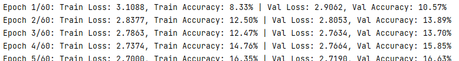

# pytor踩坑笔记

### 1.  配置conda镜像地址

    ```
    国内的pip源，如下：

    阿里云 http://mirrors.aliyun.com/pypi/simple/

    中国科技大学 https://pypi.mirrors.ustc.edu.cn/simple/

    豆瓣(douban) http://pypi.douban.com/simple/

    清华大学 https://pypi.tuna.tsinghua.edu.cn/simple/

    中国科学技术大学 http://pypi.mirrors.ustc.edu.cn/simple/

    pip3 install torch==1.10.0+cu113 torchvision==0.11.1+cu113 torchaudio==0.10.0+cu113 -f https://download.pytorch.org/whl/cu113/torch_stable.html

    ```


### 2.  datasets.ImageFolder(data_dir, transform=transform)

    datasets.ImageFolder(data_dir, transform=transform) 是 PyTorch 中用于创建图像分类任务数据集的类之一。
    ImageFolder 类用于加载包含图像数据的文件夹，并根据文件夹的结构自动进行标签化。它假设数据集的文件夹结构如下：

    ```
    root/class_1/image_1.jpg
    root/class_1/image_2.jpg
    root/class_2/image_1.jpg
    root/class_2/image_2.jpg
    ```

    其中 root 是数据集的根目录，class_1、class_2 等是不同的类别名称，image_1.jpg、image_2.jpg 等是对应类别的图像文件。
    data_dir 参数是数据集的根目录路径，transform 参数是应用于图像数据的预处理转换操作，例如缩放、裁剪、标准化等。

    #### 踩坑点：data_dir中文件夹的分类方式为按字符大小分类

### 3.  其他问题
    
1. 问题：训练集 验证集准确率还可以，但是测试集结果垃圾</p>
    答：训练集，验证机来自同一个数据集划分出来的原因


2.**过度调整过拟合参数导致模型收敛速度慢**

    正则化过大可能会导致模型收敛困难或无法收敛。
    
    正则化是一种用于控制模型复杂度和减少过拟合的技术，通过引入额外的惩罚项来约束模型的参数。正则化项的大小由超参数调节，如果正则化项过大，它可能会对模型的训练过程产生负面影响。
    当正则化项过大时，惩罚力度变得过强，可能会导致以下情况：

    参数过度压缩：正则化项的强烈惩罚可能导致模型的参数被过度压缩，限制了模型的灵活性和表达能力。这可能导致模型无法充分拟合训练数据，从而影响模型的收敛性。

    优化过程受阻：正则化项过大可能导致优化过程受阻。模型的优化目标是在损失函数和正则化项之间进行权衡，过大的正则化项会对损失函数的优化产生不利影响，使优化过程变得困难。

    欠拟合：过大的正则化项可能会导致模型发生欠拟合，即模型无法很好地适应训练数据和捕捉数据中的模式。模型在欠拟合状态下，可能不能达到预期的性能水平。

    因此，在选择正则化项的大小时，需要进行权衡和实验。过小的正则化项可能导致过拟合，而过大的正则化项可能导致模型无法收敛或欠拟合。通常，可以通过交叉验证或验证集上的性能评估来选择合适的正则化项大小，以获得良好的模型性能和收敛性。
