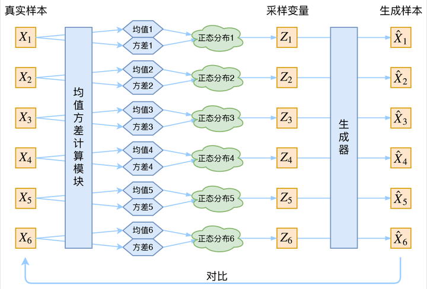
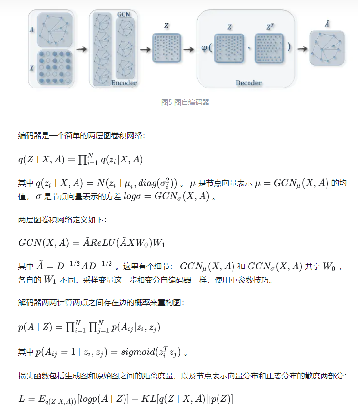

# 图神经网络

## GCN 图卷积网络
参考：https://paichin.github.io/machine/learning/2019/12/07/gcn_for_beginners.html
$$
H^{(l+1)}=\sigma\left(\tilde{D}^{-\frac{1}{2}} \tilde{A} \tilde{D}^{-\frac{1}{2}} H^{(l)} W^{(l)}\right)
$$

其中：
* $\tilde A=A+I$，$I$是单位矩阵,矩阵$A$为节点的关系矩阵，因为自己到自己的关系为0，与特征矩阵相乘时会导致特征矩阵每一次乘法时的该位置元素丢失，所以加上单位矩阵$I$
* $\tilde{D}$ 是 $\tilde{A}$的度矩阵（degree matrix）,
公式为 $\tilde{D}{ii}=\sum _{j=1} ^n { \tilde{A}{ij}}$($D$的对角线元素等于A的每一行的和，目的是利用$D^{-1}A$标准化为每一行和为1)
* $H$是每一层节点的特征矩阵，对于刚开始的输入层，$H$就是$X$, 
* $\sigma()$是非线性激活函数

>实际上，图卷积是利用其他结点的信息来推导该结点的信息。在半监督学习中，图卷积本质不是传播标签，而是在传播特征，图卷积将不知道标签的特征，传染到已知标签的特征节点上，利用已知标签节点的分类器推测其属性。 另外，图中的每个结点无时无刻不因为邻居和更远的点的影响而在改变着自己的状态直到最终的平衡，关系越亲近的邻居影响越大。

>图数据中的空间特征具有以下特点：
1） 节点特征：每个节点有自己的特征（体现在点上） 
2） 结构特征：图数据中的每个节点具有结构特征，即节点与节点存在一定的联系。（体现在边上）

>总地来说，图数据既要考虑节点信息，也要考虑结构信息，图卷积神经网络就可以自动化地既学习节点特征，又能学习节点与节点之间的关联信息。
## VAE

## VGAE VGAE（Variational graph auto-encoders）

https://zhuanlan.zhihu.com/p/78340397

## MGAE

https://zhuanlan.zhihu.com/p/613554029

图掩蔽自编码器（Graph Masked Autoencoder）是一种用于图数据的自编码器模型，它在重构过程中使用图结构信息进行掩蔽。

与传统的自编码器不同，图掩蔽自编码器在输入中引入了图的邻接矩阵和节点特征矩阵。它的主要目标是学习一个潜在空间，其中图结构信息被编码，并能够根据部分被掩蔽的输入图数据进行重构。

图掩蔽自编码器的基本思想如下：
1. 编码器部分：
   - 输入图数据：邻接矩阵 A 和节点特征矩阵 X。
   - 对节点特征矩阵进行编码，生成节点的潜在表示。
   - 对邻接矩阵进行编码，生成图结构的潜在表示。

2. 掩蔽操作：
   - 随机选择一部分节点或边进行掩蔽（即将它们的值置为零或其他特定值）。
   - 掩蔽操作能够模拟真实场景中只能观测到部分图信息的情况。

3. 解码器部分：
   - 使用编码器生成的潜在表示进行重构。
   - 对节点特征的潜在表示进行解码，生成重构的节点特征矩阵。
   - 对图结构的潜在表示进行解码，生成重构的邻接矩阵。

4. 损失函数：
   - 重构损失：通过比较重构的邻接矩阵和节点特征矩阵与原始输入的差异来度量重构质量。
   - 可以使用适当的损失函数，如均方误差或交叉熵等。

通过最小化重构损失，图掩蔽自编码器可以学习到图数据的潜在表示，并且具备一定的鲁棒性，能够在部分信息缺失的情况下进行重构。这使得图掩蔽自编码器在处理不完整或噪声图数据时具有优势，例如社交网络分析、推荐系统和异常检测等应用领域。
