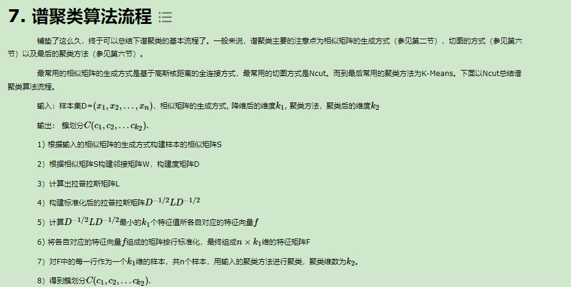

# 谱聚类
https://www.cnblogs.com/pinard/p/6221564.html

# 主成分分析（PCA）
主成分分析（Principal Component Analysis，PCA）是一种常用的降维技术，用于将高维数据转换为低维空间，并保留数据中最重要的信息。PCA通过线性变换将原始数据投影到新的特征空间，使得投影后的数据具有最大的方差。

PCA的工作原理如下：

* 数据标准化：对原始数据进行标准化处理，使得每个特征的均值为0，方差为1，以消除不同特征的量纲差异。
* 协方差矩阵计算：计算标准化后数据的协方差矩阵，该矩阵描述了原始数据中特征之间的线性关系。
* 特征值分解：对协方差矩阵进行特征值分解，得到特征值和对应的特征向量。特征向量表示了新特征空间的主轴方向，特征值表示了数据在对应特征向量方向上的方差。
* 特征值排序：将特征值按降序排列，选择最大的k个特征值对应的特征向量作为主成分。
*投影数据：将原始数据投影到选取的主成分上，得到降维后的数据。

PCA的优点包括：

可以减少数据维度，降低计算复杂度。
可以去除冗余信息，提取主要特征。
可以进行数据可视化，方便理解和解释数据。